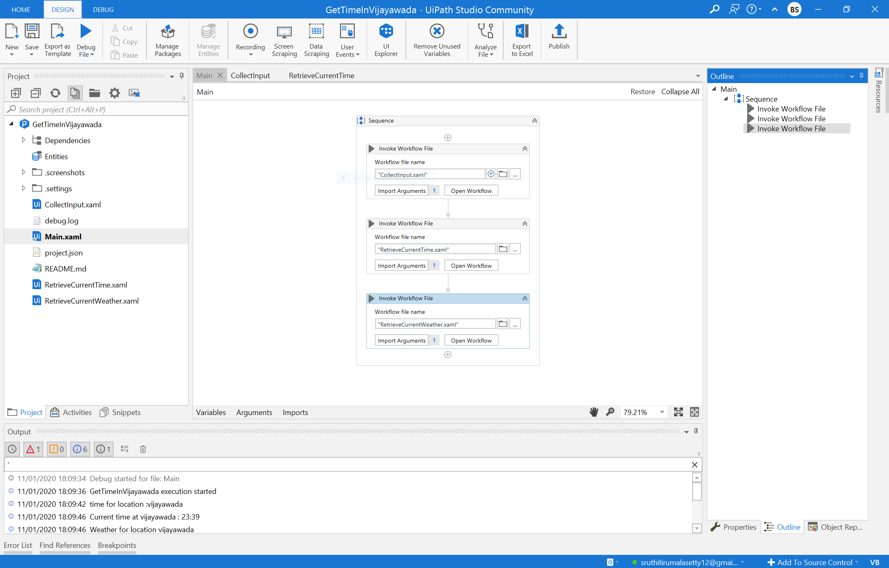
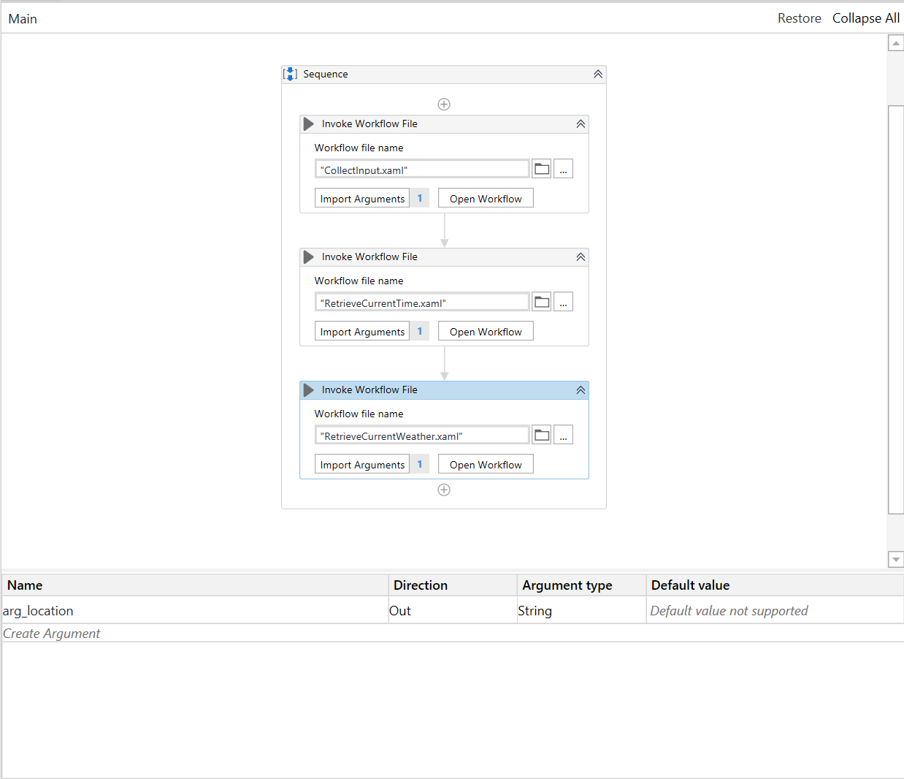
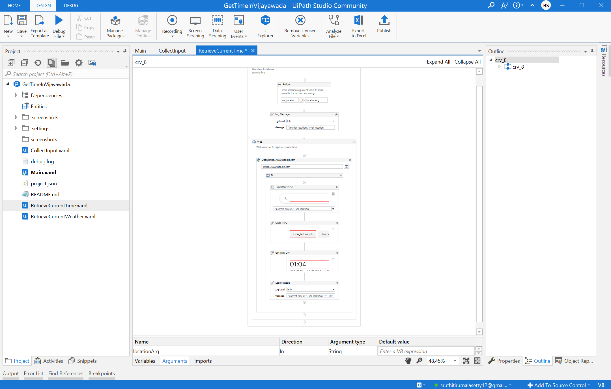
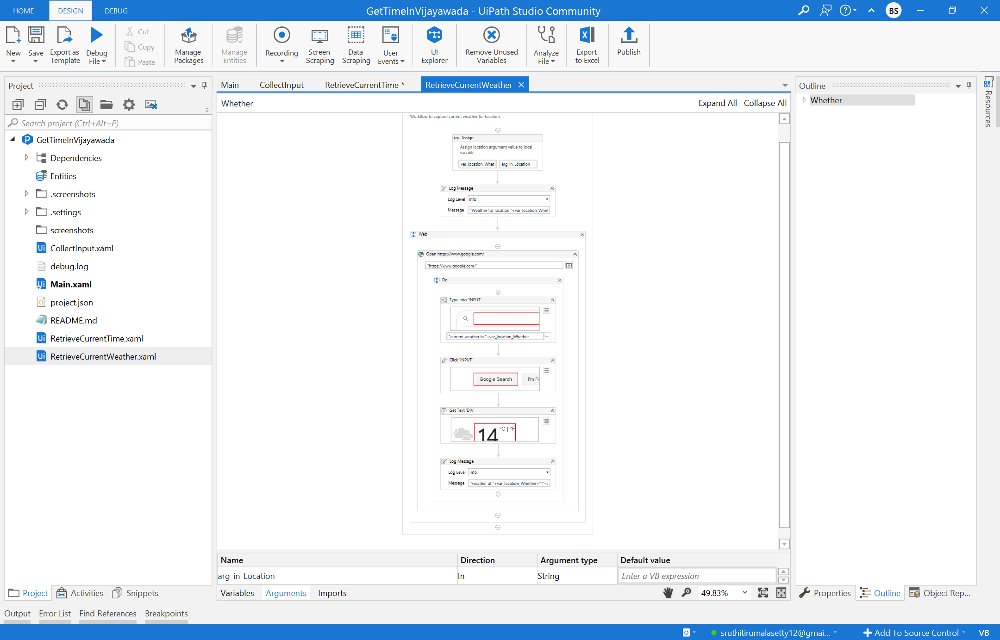

Here is a simple RPA application using UIPath framework to automate two processes using simple but effective concepts as my first iteration of UIPath learnings . As part of this application, I have automated below processes in single application. 

## Retrieving time of a location
## Retrieving weather of a location

### Concepts Used 

- Sequential Workflow 
- Web recorder 
- Passing arguments between workflows 
- Using vaiables as containers to store data 

### Activities 

- Invoke Workflow 
- Input Dialog 
- Assign 
- Log Message
- Open Browser 
- Input Text 
- Click Input 
- Get Text 
- Write line 

### Entry Workflow 

Below is how my Entry-Point Sequential work flow looks like. 

- A single workflow which will captures user input ( location ) and passes the value as out directed argument **arg_location**
- Second workflow will read the value of the **arg_location** and retrieves current time and print as **log.info**.. 
- Third workflow will read the same value of **arg_location**, retrieves current weather and print as **log.info**. 

### Arguments used 

#### Used both in and out directed arguments 

### Work flow to retrieve Current time 

### Work flow to retrieve Current Weather 

---------------------------
Bhagya Sruthi Tirumalasetty
---------------------------
